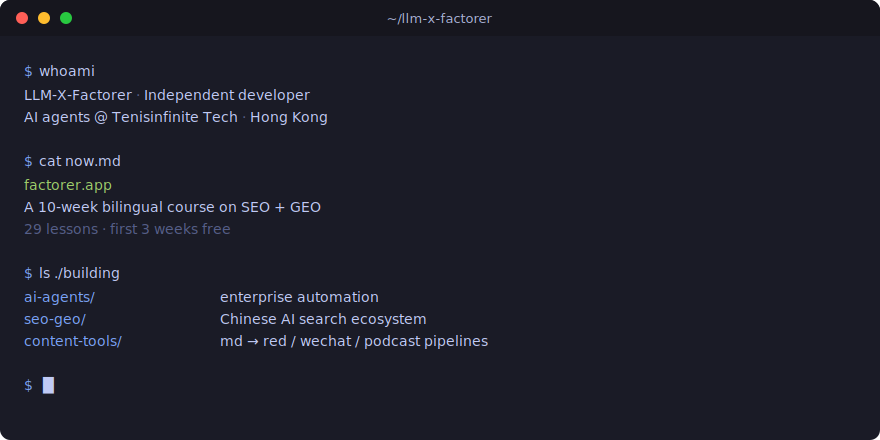

  

## 当前重点 / Currently

**[factorer.app](https://factorer.app/)** — SEO + GEO 中文入门课程，29 课时，前 3 周免费无需注册。
A 10-week bilingual course on SEO and Generative Engine Optimization.

## 在做的 / Building

<table>
  <tr>
    <td width="50%" valign="top">
      <h4>AI agents</h4>
      企业自动化咨询 @ <a href="https://www.tenisinfinite.com/">Tenisinfinite Tech</a> 
      Enterprise automation consulting
    </td>
    <td width="50%" valign="top">
      <h4>SEO / GEO</h4>
      中文 AI 搜索生态实践 
      <a href="https://github.com/LLM-X-Factorer/cn-seo-geo-atlas">cn-seo-geo-atlas</a> · <a href="https://github.com/LLM-X-Factorer/awesome-geo-cn">awesome-geo-cn</a>
    </td>
  </tr>
  <tr>
    <td valign="top">
      <h4>Content pipelines</h4>
      md → 红书 / 公众号 / 播客 / 文章 
      <a href="https://github.com/LLM-X-Factorer/md2red">md2red</a> · <a href="https://github.com/LLM-X-Factorer/podcraft">podcraft</a> · <a href="https://github.com/LLM-X-Factorer/topic2md">topic2md</a>
    </td>
    <td valign="top">
      <h4>Scout &amp; advocate</h4>
      AI 工程选题侦察 + 内容生产 SOP 
      <a href="https://github.com/LLM-X-Factorer/llmx-scout-agent">llmx-scout-agent</a> · <a href="https://github.com/LLM-X-Factorer/llmx-advocate-agent">llmx-advocate-agent</a>
    </td>
  </tr>
</table>

## 联系 / Find me

- 公司 / Company · [tenisinfinite.com](https://www.tenisinfinite.com/)
- 课程 / Course · [factorer.app](https://factorer.app/)
- Twitter / X · [@JadeGateAI](https://x.com/JadeGateAI)
- 知乎 / Zhihu · [dt-35-81](https://www.zhihu.com/people/dt-35-81)
- 小红书 / Xiaohongshu · [Profile](https://www.xiaohongshu.com/user/profile/67cfd1270000000008017fe3)
- 即刻 / Jike · [Profile](https://web.okjike.com/u/630DA54B-3708-43B1-A900-7D266794AA4C)
- B 站 / Bilibili · [Channel](https://space.bilibili.com/3546970262079983)
